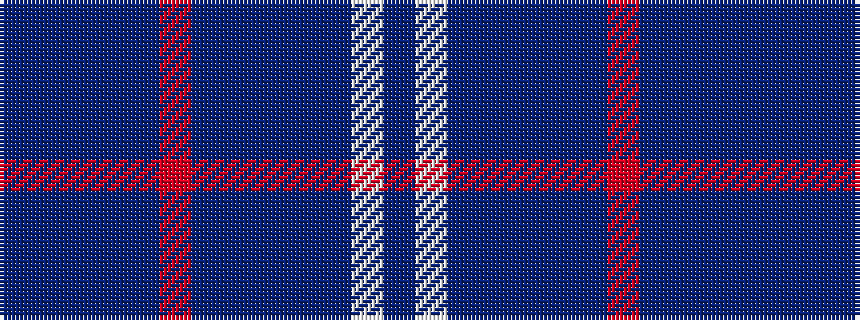

BBBBBRBBBBBWB

It is a 13 stripe tartan.

<figure class="pat-woven">

<figcaption>idealised sample</figcaption>
</figure>

## Colour Sequence



## Tartans with this colour sequence

| Tartans |
|---------------|
| [Highland Dusk (Fashion)](/setts/s13/n43db2n2db1n1r11n2db2n1n1n20w4n7~x2/)|
||
