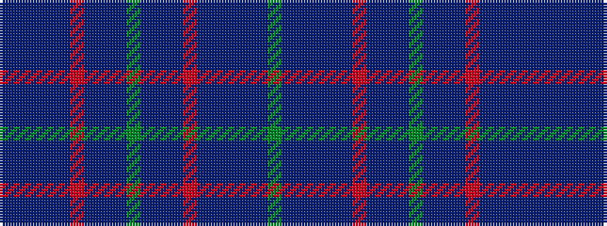

BBBBBRBBBGBBBRBBBBBG

It is a 20 stripe tartan.

<figure class="pat-woven">

<figcaption>idealised sample</figcaption>
</figure>

## Colour Sequence



## Tartans with this colour sequence

| Tartans |
|---------------|
| [Hughes of Wales](/setts/s20/db34dt20db4dt8db6r2db5dt2db3g4db3dt2db5r2db6dt8db4dt20db34g4/)|
||
