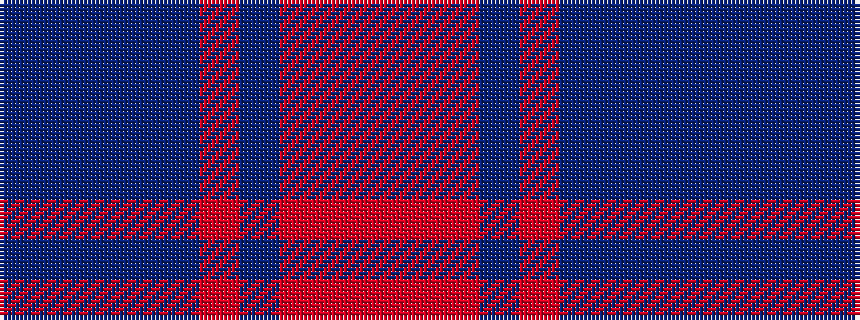

BBBBBRBRRR

It is a 10 stripe tartan.

<figure class="pat-woven">

<figcaption>idealised sample</figcaption>
</figure>

## Colour Sequence



## Tartans with this colour sequence

| Tartans |
|---------------|
| [Roscommon](/setts/s10/r5o3r19dr6o5dr6n12n5n12n3~x2/)|
||
