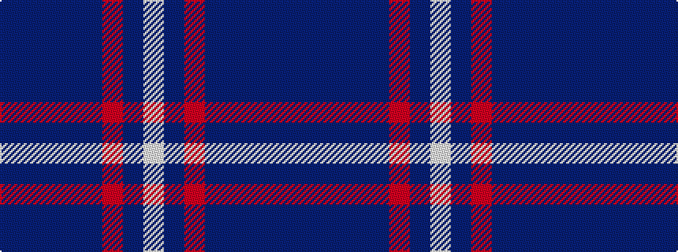

BBBBBRBW

It is a 8 stripe tartan.

<figure class="pat-woven">

<figcaption>idealised sample</figcaption>
</figure>

## Colour Sequence



## Tartans with this colour sequence

| Tartans |
|---------------|
| [Browne (Personal)](/variants/s8/n20db2n2db2n2o47db24w2/)|
||
