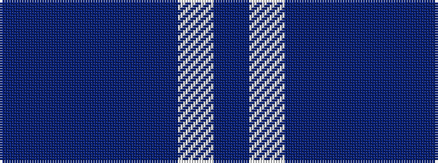

BBBBBWB

It is a 7 stripe tartan.

<figure class="pat-woven">

<figcaption>idealised sample</figcaption>
</figure>

## Colour Sequence



## Tartans with this colour sequence

| Tartans |
|---------------|
| [Gavin](/variants/s7/dri26w2dri3dt15dt26dr2dt3~x2/)|
||
