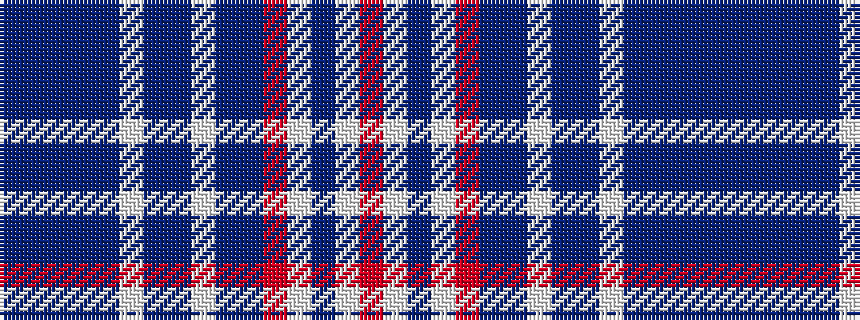

BBBBBWBBWBBRWBWR

It is a 16 stripe tartan.

<figure class="pat-woven">

<figcaption>idealised sample</figcaption>
</figure>

## Colour Sequence



## Tartans with this colour sequence

| Tartans |
|---------------|
| [Skye Dress, Blue, Earl of (Dance)](/variants/s16/db4b2n4b2db4w3db3b2w4b2db4r14w22db2w5r4~x2/)|
||
