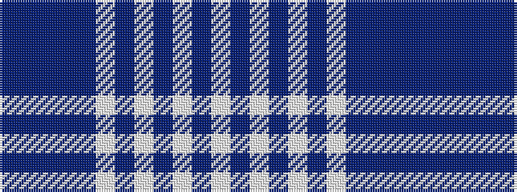

BBBBBWBWBWBW

It is a 12 stripe tartan.

<figure class="pat-woven">

<figcaption>idealised sample</figcaption>
</figure>

## Colour Sequence



## Tartans with this colour sequence

| Tartans |
|---------------|
| [Costa, David (Personal)](/setts/s12/w24db12w1db2w2db2w1db12dt3db4dt3db20~x2/)|
||
