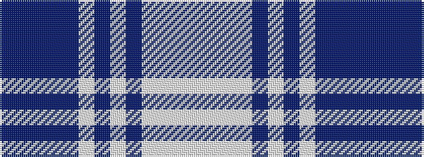

BBBBBWBWBWWWW

It is a 13 stripe tartan.

<figure class="pat-woven">

<figcaption>idealised sample</figcaption>
</figure>

## Colour Sequence



## Tartans with this colour sequence

| Tartans |
|---------------|
| [Diamond Jubilee (McGill) (Fashion)](/setts/s13/dp36dpi8dp2dpi8dp1lb2dp4lb2dp4lb18w2lb1w4~x2/)|
||
