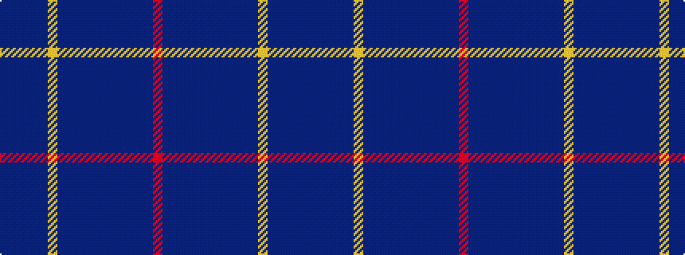

BBBBBYBBBBBBBBBBR

It is a 17 stripe tartan.

<figure class="pat-woven">

<figcaption>idealised sample</figcaption>
</figure>

## Colour Sequence



## Tartans with this colour sequence

| Tartans |
|---------------|
| [Fulbright, Senator (Personal)](/variants/s17/db2dbi2t4db2t6lr4t5db2dbi4db6dbi4n2db2dbi12db2dbi3r1~x2/)|
||
