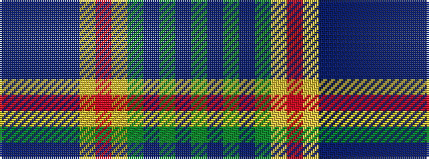

BBBBBYRYGBGBG

It is a 13 stripe tartan.

<figure class="pat-woven">

<figcaption>idealised sample</figcaption>
</figure>

## Colour Sequence



## Tartans with this colour sequence

| Tartans |
|---------------|
| [McCulloch, Grant (Personal)](/setts/s13/n6db1n1db1n3lr2r1lr2y3db1y1db1y6~x4/)|
||
