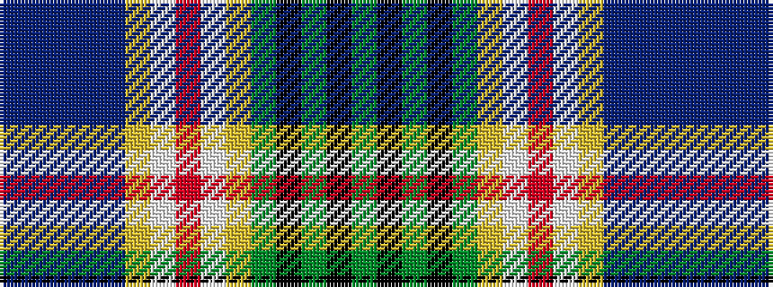

BBBBBYWRWYGKGKG

It is a 15 stripe tartan.

<figure class="pat-woven">

<figcaption>idealised sample</figcaption>
</figure>

## Colour Sequence



## Tartans with this colour sequence

| Tartans |
|---------------|
| [McCulloch (Military Colours)](/setts/s15/dg6k1dg1k1dg3lr1lb1r1lb1lr1b3db1b1db1b6~x4/)|
||
| [McCulloch (Personal)](/setts/s15/y6k1y1k1y3lr1w1r1w1lr1t3db1t1db1t6~x4/)|
||
