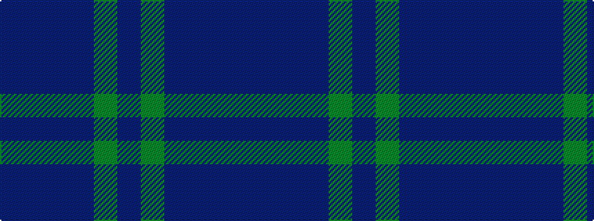

BBBBGB

It is a 6 stripe tartan.

<figure class="pat-woven">

<figcaption>idealised sample</figcaption>
</figure>

## Colour Sequence



## Tartans with this colour sequence

This pattern is a design lineage: every tartan below shares one colour order, whatever its owner —
near-identical designs are grouped, the largest lineage first (#112: the pattern is a tartan's
second parent, beside its family or clan).

<table class="sett-table">
<tbody>
<tr><td><a href="/variants/s6/db1g10db9t10db1t1~x4/">Black Watch (Aljean)</a></td></tr>
<tr><td class="sett-swatch"></td></tr>
<tr><td><a href="/setts/dbi7db2dbi25db10g21db2/">Sugiyama</a></td></tr>
<tr><td class="sett-swatch"></td></tr>
<tr><td><a href="/variants/s6/b7db2b25db10g21db2~x2~b1511266-db1108266/">Sugiyama Corporate Tartan</a></td></tr>
<tr><td class="sett-swatch"></td></tr>
<tr><td><a href="/variants/s6/db2g6db6b5db1b2~x2/">Unnamed, No 54</a></td></tr>
<tr><td class="sett-swatch"></td></tr>
<tr class="cluster-sep"><td></td></tr>
<tr><td><a href="/variants/s6/db13b1db3b6y1b1~x4/">Hepburn</a></td></tr>
<tr><td class="sett-swatch"></td></tr>
<tr class="cluster-sep"><td></td></tr>
<tr><td><a href="/variants/s6/db2g6db6dp5db1dp2~x2/">Unidentified no. 54</a></td></tr>
<tr><td class="sett-swatch"></td></tr>
</tbody>
</table>

