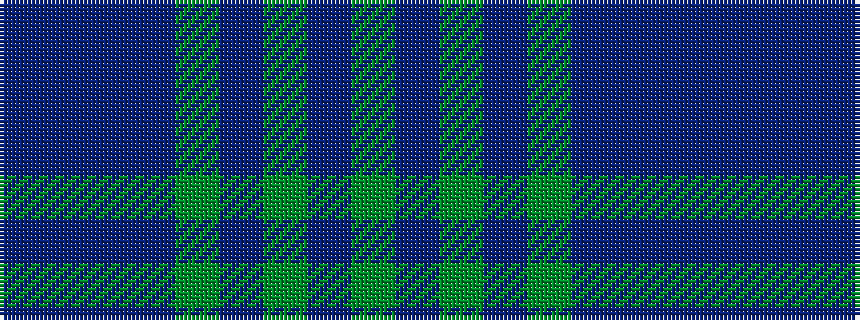

BBBBGBGBG

It is a 9 stripe tartan.

<figure class="pat-woven">

<figcaption>idealised sample</figcaption>
</figure>

## Colour Sequence



## Tartans with this colour sequence

| Tartans |
|---------------|
| [Lindsay](/setts/s9/dg20db2dg2db2dg2db8dr24db2dr3~x2/)|
||
| [Lindsay](/setts/s9/dg20db2dg2db2dg2db8dr24db2dr3/)|
||
