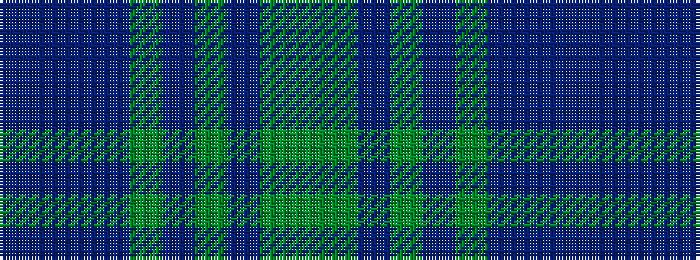

BBBBGBGBGG

It is a 10 stripe tartan.

<figure class="pat-woven">

<figcaption>idealised sample</figcaption>
</figure>

## Colour Sequence



## Tartans with this colour sequence

| Tartans |
|---------------|
| [Jones (Welsh Name)](/setts/s10/db6t3db3t15dg7db7dg5db17dg46dg4/)|
||
