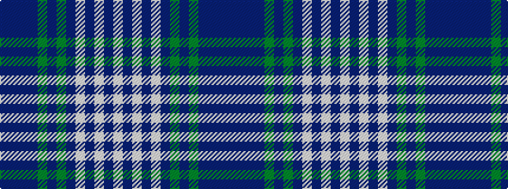

BBBBGBGBWBWBW

It is a 13 stripe tartan.

<figure class="pat-woven">

<figcaption>idealised sample</figcaption>
</figure>

## Colour Sequence



## Tartans with this colour sequence

| Tartans |
|---------------|
| [Black Watch Dress, Brown/Grey (Fash)](/variants/s13/n1dt1n3dt3y4dt1y4dt3lb1n1lb6n1lb1~x4/)|
||
