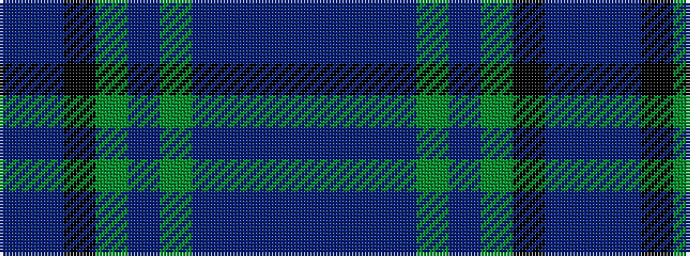

BBBBGBGKBB

It is a 10 stripe tartan.

<figure class="pat-woven">

<figcaption>idealised sample</figcaption>
</figure>

## Colour Sequence



## Tartans with this colour sequence

| Tartans |
|---------------|
| [Spirit of Alva](/setts/s10/t6db10dp4db12dg19dp4dg8k20db50t4/)|
||
