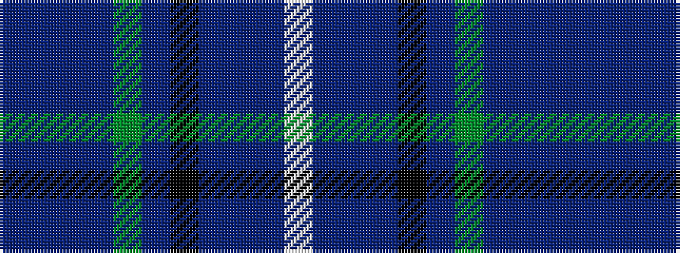

BBBBGBKBBBW

It is a 11 stripe tartan.

<figure class="pat-woven">

<figcaption>idealised sample</figcaption>
</figure>

## Colour Sequence



## Tartans with this colour sequence

| Tartans |
|---------------|
| [Spirit of the Glen (Corporate)](/setts/s11/p2db4db7db3dg20db5k7db3dp3dt35w2~x2/)|
||
