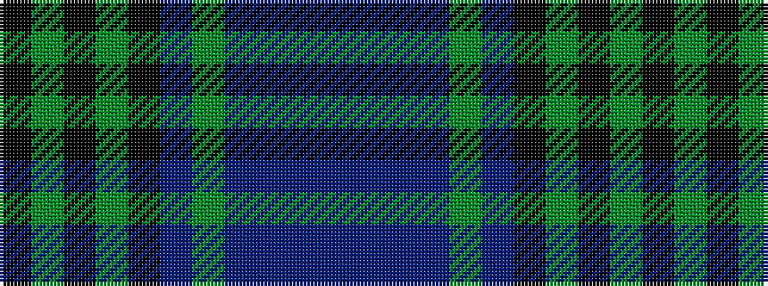

BBBBGBKGKGK

It is a 11 stripe tartan.

<figure class="pat-woven">

<figcaption>idealised sample</figcaption>
</figure>

## Colour Sequence



## Tartans with this colour sequence

| Tartans |
|---------------|
| [Manderson](/variants/s11/k4y10k4g8k12dr4g16t16dr5t6dr2~x2/)|
||
