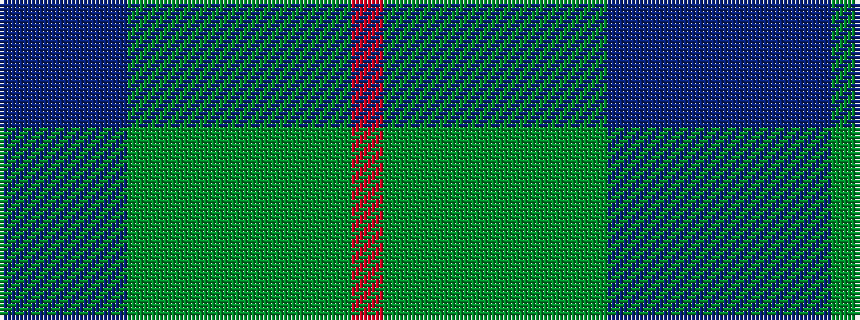

BBBBGGGGGGGR

It is a 12 stripe tartan.

<figure class="pat-woven">

<figcaption>idealised sample</figcaption>
</figure>

## Colour Sequence



## Tartans with this colour sequence

| Tartans |
|---------------|
| [Kinloch Anderson Heather (Corporate)](/setts/s12/dp4dp4dp2dp14dg6g3dg6g2g4g2g15o3~x2/)|
||
