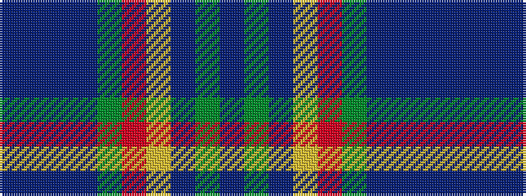

BBBBGRYBGB

It is a 10 stripe tartan.

<figure class="pat-woven">

<figcaption>idealised sample</figcaption>
</figure>

## Colour Sequence



## Tartans with this colour sequence

| Tartans |
|---------------|
| [Lyon, Jeffrey M (Hunting) (Personal)](/setts/s10/t27dt2t2dt16g5r5lo2dt2dy14dt2~x2/)|
||
| [Lyon, Jeffrey M (Hunting) (Personal)](/setts/s10/t30b1t1b16g5r5ly2b2dy15b1~x2/)|
||
