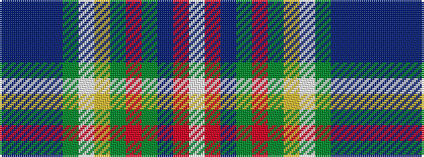

BBBBGWYGRGBRW

It is a 13 stripe tartan.

<figure class="pat-woven">

<figcaption>idealised sample</figcaption>
</figure>

## Colour Sequence



## Tartans with this colour sequence

| Tartans |
|---------------|
| [Pearl of the Orient](/variants/s13/dp4dt20db4dt6g6w2ly4g4r2g18db4r1w4~x2/)|
||
