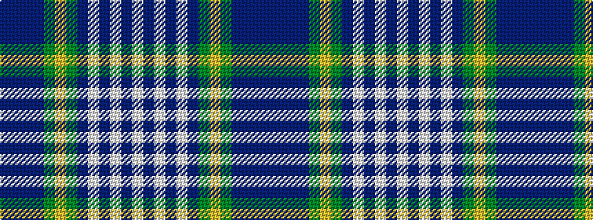

BBBBGYGBWBWBW

It is a [13 stripe pattern](/stripes/stripes13/) — every 13-stripe pattern is gathered there.

<figure class="pat-woven">

<figcaption>idealised sample</figcaption>
</figure>

## Colour Sequence



## Tartans with this colour sequence

This pattern is a design lineage: every tartan below shares one colour order, whatever its owner —
near-identical designs are grouped, the largest lineage first (#112: the pattern is a tartan's
second parent, beside its family or clan).

<table class="sett-table">
<tbody>
<tr><td><a href="/tartans/c/ca/calgary/">Calgary</a></td></tr>
<tr><td class="sett-swatch"></td></tr>
</tbody>
</table>

