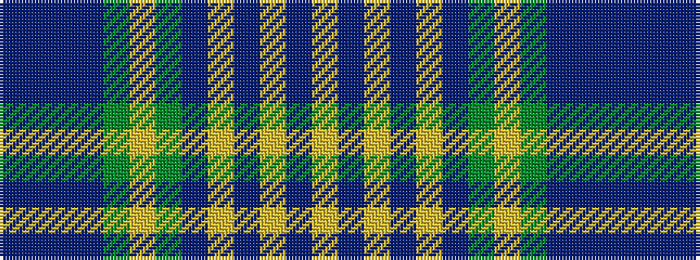

BBBBGYGBYBYBY

It is a 13 stripe tartan.

<figure class="pat-woven">

<figcaption>idealised sample</figcaption>
</figure>

## Colour Sequence



## Tartans with this colour sequence

| Tartans |
|---------------|
| [Calgary (Deerskin Trading Post)](/setts/s13/db2b1db4b4g4lo2g4b4lr3b3lr6b2lr2~x2/)|
||
| [Calgary (Fashion)](/setts/s13/b2db1b4db4g4lo2g4db4lr3db3lr6db2lr2~x2/)|
||
