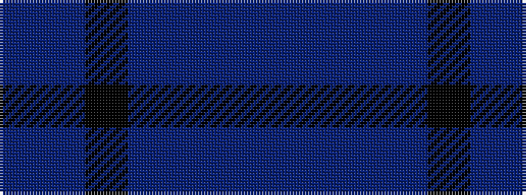

BBBBKBB

It is a 7 stripe tartan.

<figure class="pat-woven">

<figcaption>idealised sample</figcaption>
</figure>

## Colour Sequence



## Tartans with this colour sequence

| Tartans |
|---------------|
| [Van Loo (Personal)](/variants/s7/t5db30k25t5db30dp2t5~x2/)|
||
| [Van Loo Tartan](/variants/s7/t5db30k25t5db30dp3t5~x2/)|
||
