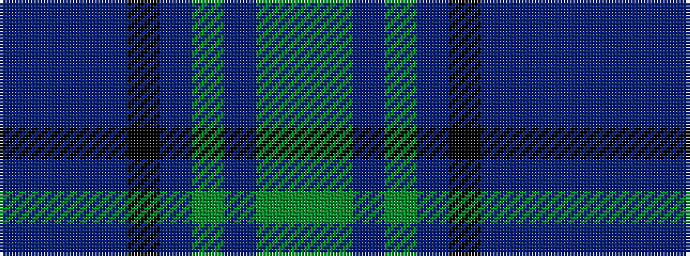

BBBBKBGBGG

It is a 10 stripe tartan.

<figure class="pat-woven">

<figcaption>idealised sample</figcaption>
</figure>

## Colour Sequence



## Tartans with this colour sequence

| Tartans |
|---------------|
| [Jones Htg (Name)](/setts/s10/dp4t2dp2t8k3dp8g3dp4g24g2~x2/)|
||
