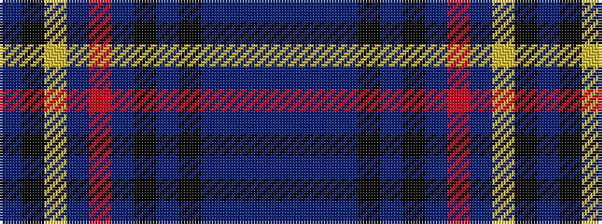

BBBBKBKBRBYKB

It is a 13 stripe tartan.

<figure class="pat-woven">

<figcaption>idealised sample</figcaption>
</figure>

## Colour Sequence



## Tartans with this colour sequence

| Tartans |
|---------------|
| [Dempster (Name)](/variants/s13/b12db3b12db16k3db6k3db16r3db3lo3k16db4~x2/)|
||
