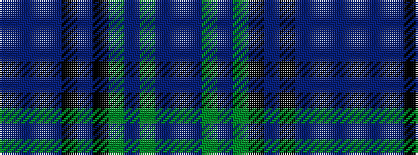

BBBBKBKGBGBB

It is a 12 stripe tartan.

<figure class="pat-woven">

<figcaption>idealised sample</figcaption>
</figure>

## Colour Sequence



## Tartans with this colour sequence

| Tartans |
|---------------|
| [Kinloch Anderson Thistle](/variants/s12/b8db8b4db28k12dp7k12g4dp8g4dp28p8/)|
||
