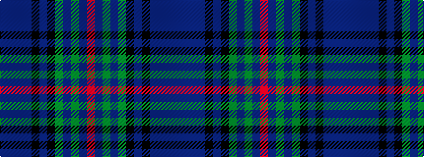

BBBBKBKGBGBR

It is a 12 stripe tartan.

<figure class="pat-woven">

<figcaption>idealised sample</figcaption>
</figure>

## Colour Sequence



## Tartans with this colour sequence

| Tartans |
|---------------|
| [Kinloch Anderson Thistle (Fashion)](/setts/s12/db8dbi8db4dbi28k12dp7k12dg4dp8dg4dp28m8/)|
||
