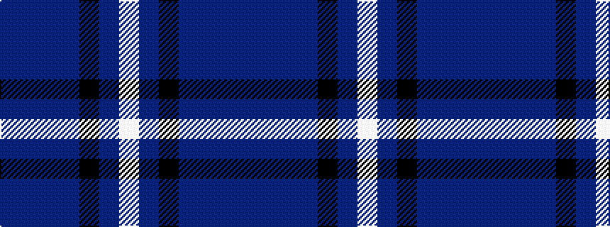

BBBBKBW

It is a 7 stripe tartan.

<figure class="pat-woven">

<figcaption>idealised sample</figcaption>
</figure>

## Colour Sequence



## Tartans with this colour sequence

| Tartans |
|---------------|
| [Allianz Deutschland 2012](/variants/s7/n6db3n6db20k20db8w4~x2/)|
||
| [Allianz Deutschland 2012 (Corporate)](/variants/s7/dbi6db3dbi6db20k20db8w4~x2/)|
||
