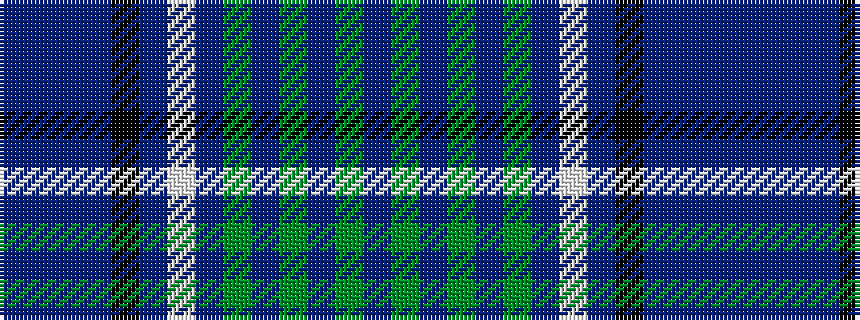

BBBBKBWBGBGBGB

It is a 14 stripe tartan.

<figure class="pat-woven">

<figcaption>idealised sample</figcaption>
</figure>

## Colour Sequence



## Tartans with this colour sequence

| Tartans |
|---------------|
| [Strathtummel (District?)](/setts/s14/db37dp2db2dp3k13dp10w2dp10y1dp2y2dp2y9dp13~x2/)|
||
