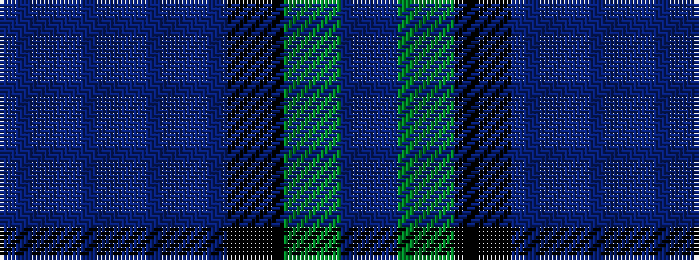

BBBBKGB

It is a 7 stripe tartan.

<figure class="pat-woven">

<figcaption>idealised sample</figcaption>
</figure>

## Colour Sequence



## Tartans with this colour sequence

| Tartans |
|---------------|
| [Saorsa](/setts/s7/dp18dg24k3db6dp2db5dp18~x2/)|
||
