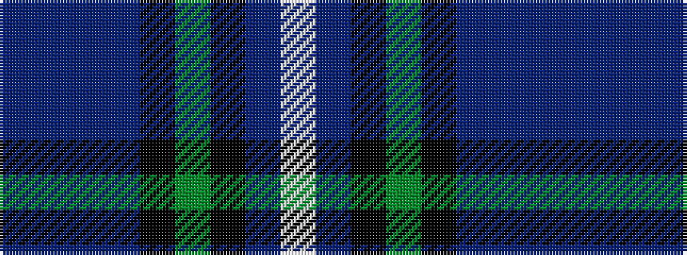

BBBBKGKBW

It is a 9 stripe tartan.

<figure class="pat-woven">

<figcaption>idealised sample</figcaption>
</figure>

## Colour Sequence



## Tartans with this colour sequence

| Tartans |
|---------------|
| [Redgate (Connecticut) Hunting](/setts/s9/t1dr4t12dr1k7dg12k7do21w1~x2/)|
||
