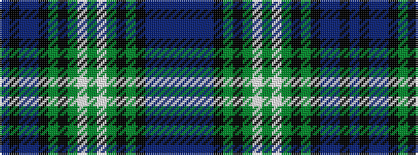

BBBBKGKGWGWGKGKBBKB

It is a 19 stripe tartan.

<figure class="pat-woven">

<figcaption>idealised sample</figcaption>
</figure>

## Colour Sequence



## Tartans with this colour sequence

| Tartans |
|---------------|
| [Spirit of Morningside](/setts/s19/dp4db5dp3db50k15g3k5g32w2g3w2g32k5g5k15db50dp3k5dp3/)|
||
