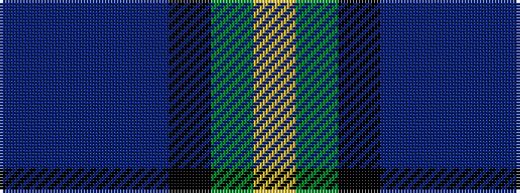

BBBBKGY

It is a 7 stripe tartan.

<figure class="pat-woven">

<figcaption>idealised sample</figcaption>
</figure>

## Colour Sequence



## Tartans with this colour sequence

| Tartans |
|---------------|
| [Ayrshire](/variants/s7/p11db2t4db21k16g19ly4~x2/)|
||
| [Ayrshire (International Tartans)](/variants/s7/dp11db2t4db21k16dg19ly4~x2/)|
||
| [East Lothian](/variants/s7/t6db17p4db2k11g33ly4~x2/)|
||
| [East Lothian](/variants/s7/t6db17dp4db2k11g3ly4~x2/)|
||
| [Renfrewshire](/variants/s7/dp4db2t8db25k8g13ly4~x2/)|
||
| [Renfrewshire Tartan](/variants/s7/p4db2t8db25k8g13ly4~x2/)|
||
