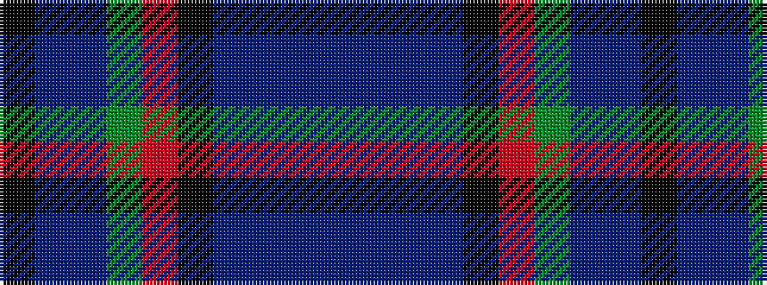

BBBBKRGBBK

It is a 10 stripe tartan.

<figure class="pat-woven">

<figcaption>idealised sample</figcaption>
</figure>

## Colour Sequence



## Tartans with this colour sequence

| Tartans |
|---------------|
| [Unidentified #2](/variants/s10/k14t2db6dg7r2k14db6t2db2t4~x2/)|
||
| [Unidentified 13](/variants/s10/k14t2db6g7r2k14db6t2db2t4~x2/)|
||
