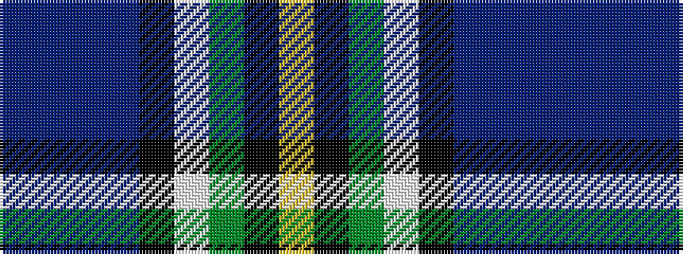

BBBBKWGKY

It is a 9 stripe tartan.

<figure class="pat-woven">

<figcaption>idealised sample</figcaption>
</figure>

## Colour Sequence



## Tartans with this colour sequence

| Tartans |
|---------------|
| [Leung (Personal)](/variants/s9/dp4db7dp2db25k19w2dg23k2lo3~x2/)|
||
