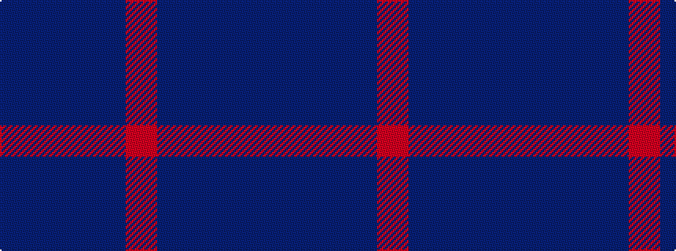

BBBBR

It is a 5 stripe tartan.

<figure class="pat-woven">

<figcaption>idealised sample</figcaption>
</figure>

## Colour Sequence



## Tartans with this colour sequence

| Tartans |
|---------------|
| [Cairns, David (Personal)](/variants/s5/do11n1do4n8r1~x8/)|
||
| [Feniston (Personal)](/variants/s5/dr30db10dr3db30m3~x2/)|
||
