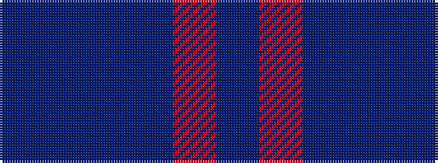

BBBBRB

It is a 6 stripe tartan.

<figure class="pat-woven">

<figcaption>idealised sample</figcaption>
</figure>

## Colour Sequence



## Tartans with this colour sequence

| Tartans |
|---------------|
| [French Freemasons' Pride (Fashion)](/variants/s6/db128r8t41n4t4n4/)|
||
| [United French Freemasons (Corporate](/variants/s6/db144r9t44db4t4db4/)|
||
