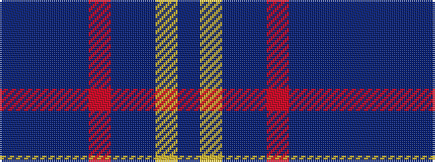

BBBBRBBYB

It is a 9 stripe tartan.

<figure class="pat-woven">

<figcaption>idealised sample</figcaption>
</figure>

## Colour Sequence



## Tartans with this colour sequence

| Tartans |
|---------------|
| [Stone of Destiny, The (Commemorative](/setts/s9/db4lo2db20dt2r4dt2db3dt12db2~x2/)|
||
