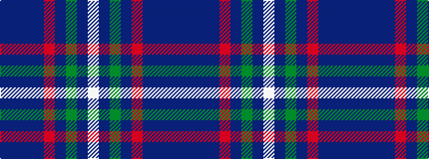

BBBBRBGBW

It is a 9 stripe tartan.

<figure class="pat-woven">

<figcaption>idealised sample</figcaption>
</figure>

## Colour Sequence



## Tartans with this colour sequence

| Tartans |
|---------------|
| [Scozia (Fashion)](/variants/s9/dt3db4dt24db6r3db4g3db8w3~x2/)|
||
