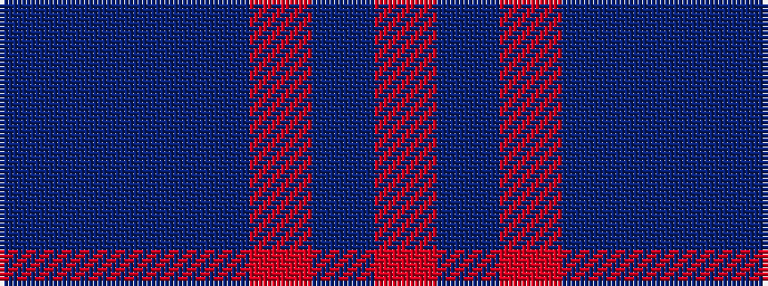

BBBBRBR

It is a 7 stripe tartan.

<figure class="pat-woven">

<figcaption>idealised sample</figcaption>
</figure>

## Colour Sequence



## Tartans with this colour sequence

| Tartans |
|---------------|
| [Great Scot (Fashion)](/variants/s7/db12t6db52dt41m12dp6m12/)|
||
