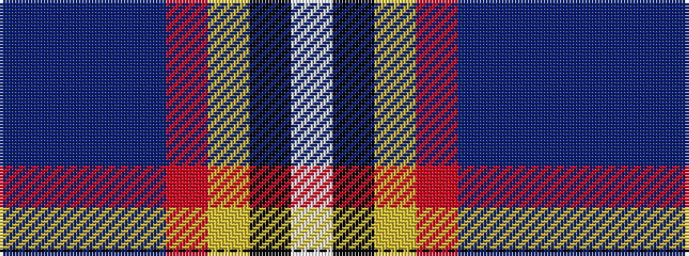

BBBBRYKW

It is a 8 stripe tartan.

<figure class="pat-woven">

<figcaption>idealised sample</figcaption>
</figure>

## Colour Sequence



## Tartans with this colour sequence

| Tartans |
|---------------|
| [Maryland](/setts/s8/dt8t1db1t1m12ly6k12w2~x4/)|
||
