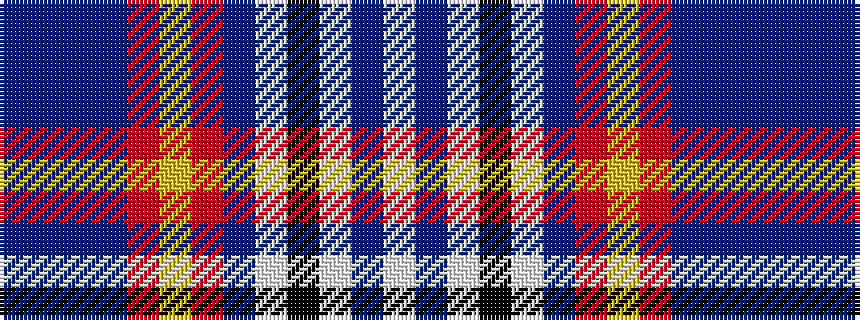

BBBBRYRBWKWBW

It is a 13 stripe tartan.

<figure class="pat-woven">

<figcaption>idealised sample</figcaption>
</figure>

## Colour Sequence



## Tartans with this colour sequence

| Tartans |
|---------------|
| [Gordon, dress 5](/setts/s13/w6db3w18k5w5dr10o17ly4o17dr10t10dr2t4~x2/)|
||
