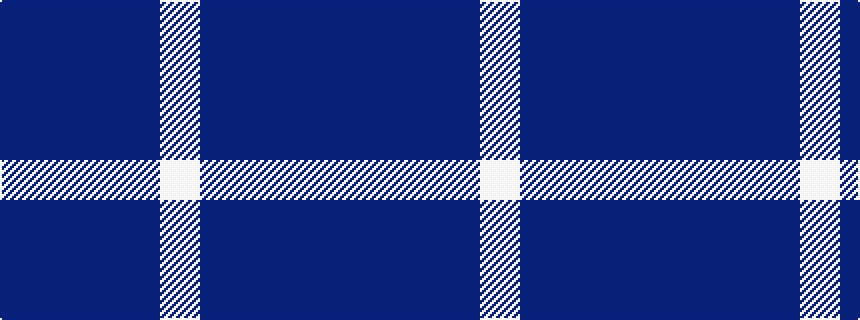

BBBBW

It is a 5 stripe tartan.

<figure class="pat-woven">

<figcaption>idealised sample</figcaption>
</figure>

## Colour Sequence



## Tartans with this colour sequence

| Tartans |
|---------------|
| [Gallaecia (Unofficial) (District)](/variants/s5/db24t13db4t4w2~x2/)|
||
| [Gallaecia - Galicia National](/variants/s5/db24n13db4n4w2~x2/)|
||
| [Gilt Edge (Corporate)](/variants/s5/db3dbi2t31db34w2~x2/)|
||
| [GulfMark](/variants/s5/dt72b6dt12b17w6~x2/)|
||
| [Gulfmark (Corporate)](/variants/s5/db72t6db12t17w6~x2/)|
||
| [Loch Lomond Trade Tartan](/variants/s5/t37b9t3db9w3~x2/)|
||
