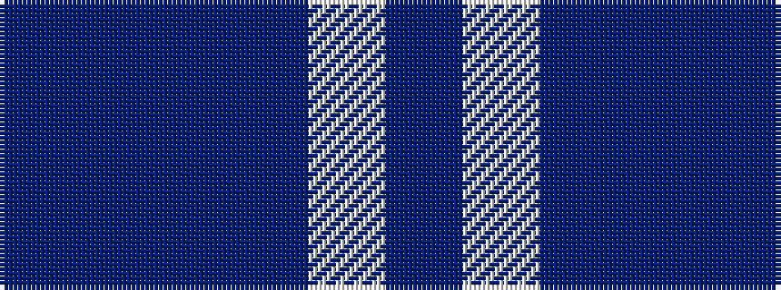

BBBBWB

It is a [6 stripe pattern](/stripes/stripes6/) — every 6-stripe pattern is gathered there.

<figure class="pat-woven">

<figcaption>idealised sample</figcaption>
</figure>

## Colour Sequence



## Tartans with this colour sequence

This pattern is a design lineage: every tartan below shares one colour order, whatever its owner —
near-identical designs are grouped, the largest lineage first (#112: the pattern is a tartan's
second parent, beside its family or clan).

<table class="sett-table">
<tbody>
<tr><td><a href="/tartans/a/au/auchairne-2/">Auchairne</a></td></tr>
<tr><td class="sett-swatch"></td></tr>
<tr><td><a href="/tartans/e/er/erskine/">Erskine</a> <small class="dt">ΔTartan 0.79</small></td></tr>
<tr><td class="sett-swatch"></td></tr>
<tr class="cluster-sep"><td></td></tr>
<tr><td><a href="/tartans/c/co/covenant-college/">Covenant College</a> <small class="dt">ΔTartan 1.55</small></td></tr>
<tr><td class="sett-swatch"></td></tr>
<tr class="cluster-sep"><td></td></tr>
<tr><td><a href="/tartans/g/ga/gavin-2/">Gavin</a> <small class="dt">ΔTartan 10.08</small></td></tr>
<tr><td class="sett-swatch"></td></tr>
</tbody>
</table>

