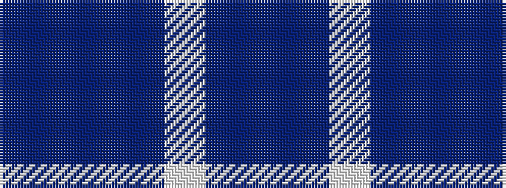

BBBBWBB

It is a 7 stripe tartan.

<figure class="pat-woven">

<figcaption>idealised sample</figcaption>
</figure>

## Colour Sequence



## Tartans with this colour sequence

| Tartans |
|---------------|
| [Langdons](/setts/s7/db2t4w1t4db6t2db2~x4/)|
||
