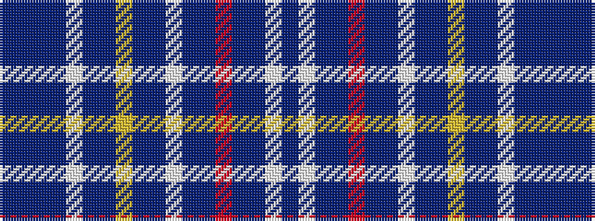

BBBBWBBYBBWBBRBBWB

It is a 18 stripe tartan.

<figure class="pat-woven">

<figcaption>idealised sample</figcaption>
</figure>

## Colour Sequence



## Tartans with this colour sequence

| Tartans |
|---------------|
| [Vilario (Personal))](/variants/s18/dt20p2dt20t10w1t10dt20ly2dt20t10w1t10dt20r2dt20t10w1t10~x2/)|
||
