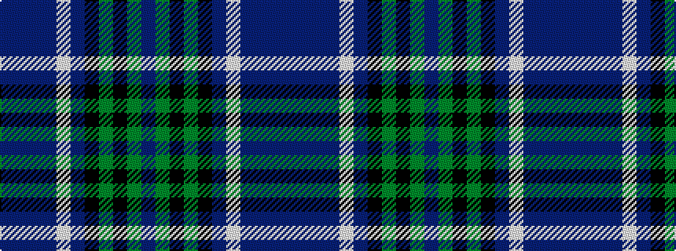

BBBBWBKGKGB

It is a 11 stripe tartan.

<figure class="pat-woven">

<figcaption>idealised sample</figcaption>
</figure>

## Colour Sequence



## Tartans with this colour sequence

| Tartans |
|---------------|
| [Smithers (Name)](/variants/s11/dp2b6n1b3lb1b4k6g5k1g5dp2~x4/)|
||
