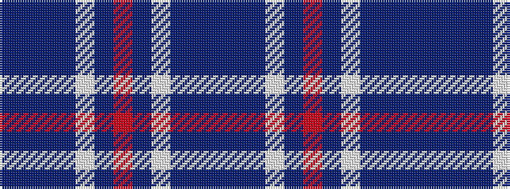

BBBBWBRBWBBB

It is a 12 stripe tartan.

<figure class="pat-woven">

<figcaption>idealised sample</figcaption>
</figure>

## Colour Sequence



## Tartans with this colour sequence

| Tartans |
|---------------|
| [St. George's School (Birmingham)](/variants/s12/r4dt21w2dt20db21dt2db2~x2/)|
||
