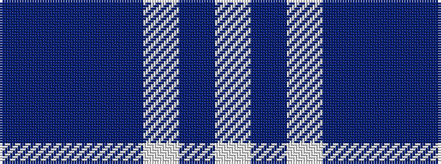

BBBBWBW

It is a 7 stripe tartan.

<figure class="pat-woven">

<figcaption>idealised sample</figcaption>
</figure>

## Colour Sequence



## Tartans with this colour sequence

| Tartans |
|---------------|
| [Gavin (Personal)](/variants/s7/w26dri2w3dri15dri26dr2dri3~x2/)|
||
